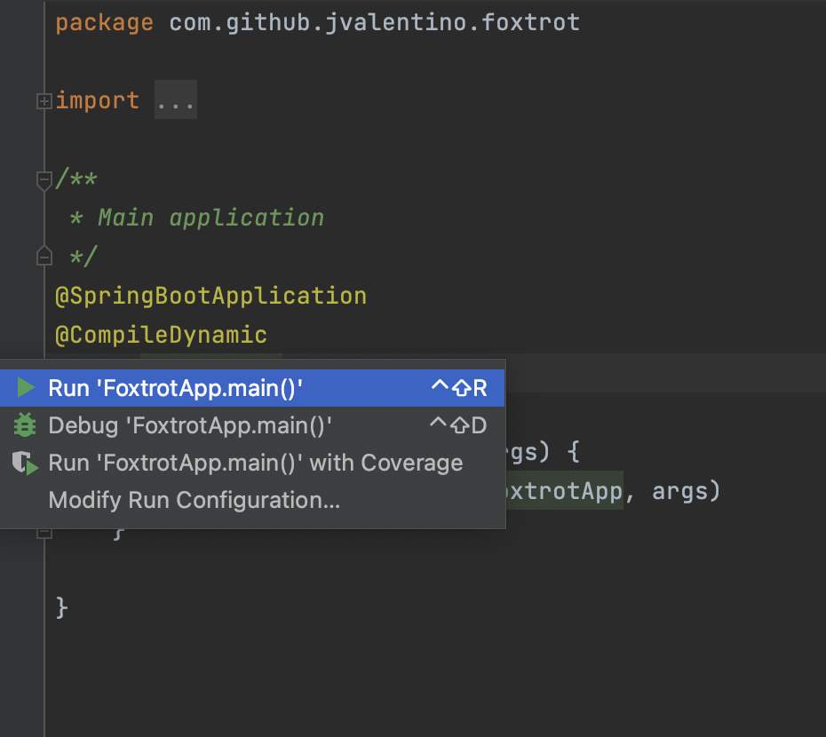
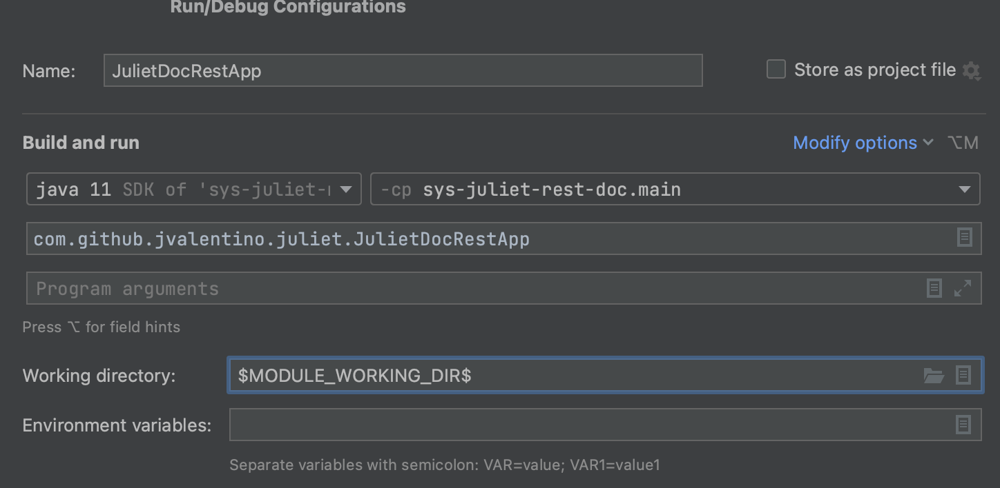
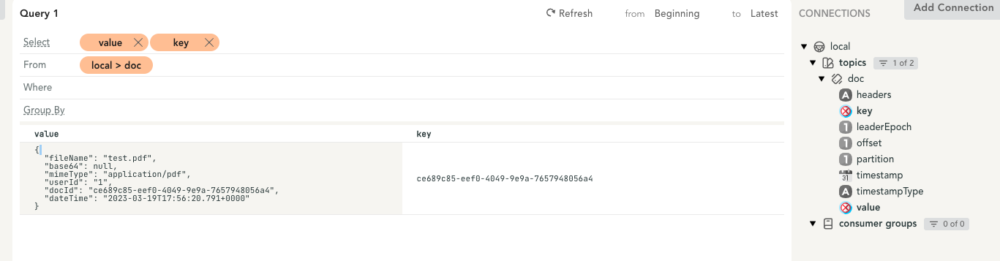
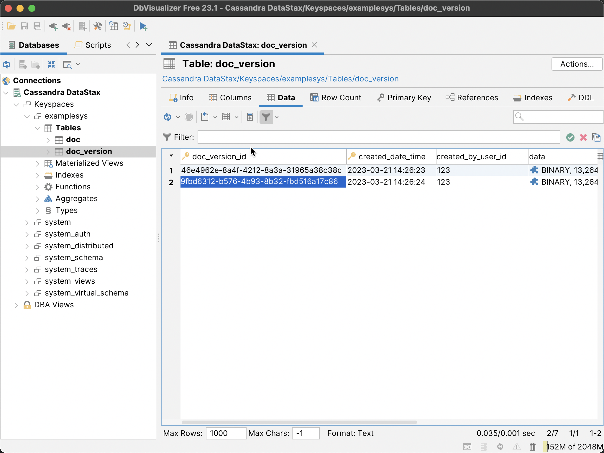

# System Kilo Doc Aggregator

This application serves as a means of listening for events as they related to the document domain, and turning those events into a Cassandra based model as  part of the overall https://github.com/jvalentino/sys-kilo project as they relate to documents. For system level details, please see that location.

Prerequisites

- Java
- IntelliJ
- Docker
- Docker Compose
- Git
- Minikube
- Helm
- Cassandra (for cqlsh)
- DbViz
- Kafka IDE

All of these you can get in one command using this installation automation (if you are on a Mac): https://github.com/jvalentino/setup-automation

# Contents

- [Summary](#summary)
  * [Database](#database)
  * [IDE Testing](#ide-testing)
  * [Runtime](#runtime)
  * [Verification](#verification)
  * [Strategy](#strategy)
  * [Build](#build)
- [Dev](#dev)
  * [Prometheus](#prometheus)
    + [build.gradle](#buildgradle)
    + [application.properties](#applicationproperties)
    + [SpringWebConfig](#springwebconfig)
    + [WebSecurityConfig](#websecurityconfig)
  * [Docker](#docker)
    + [build-docker.sh](#build-dockersh)
    + [Dockerfile](#dockerfile)
    + [fluentbit.conf](#fluentbitconf)
    + [start.sh](#startsh)
  * [OpenAPI](#openapi)
    + [build.gradle](#buildgradle-1)
    + [SpringWebConfig](#springwebconfig-1)
    + [application.properties](#applicationproperties-1)
    + [UI](#ui)
  * [Resilience4j](#resilience4j)
    + [build.gradle](#buildgradle-2)
    + [DocRest (Controller)](#docrest-controller)
    + [application.yml](#applicationyml)
    + [/actuator/health](#actuatorhealth)
  * [API Key Security](#api-key-security)
    + [SwaggerConfiguration](#swaggerconfiguration)
    + [SecurityFilter](#securityfilter)
    + [application.properties](#applicationproperties-2)

# Summary

## Infrastructure

You launch the database container by running:

```
docker compose up -d
```

This sill executes the container in detached mode, and leave it running in the background.

You then have to create the Kafka topic:

```bash
./create-topics.sh
```


## IDE Testing

This imports as a standard Gradle project, in which you are able to easily execute tests:

[](https://github.com/jvalentino/sys-alpha-bravo/blob/main/wiki/testing.png)

## Runtime

You can run the main class as a Spring Boot application:



## Verification

[](https://github.com/jvalentino/sys-alpha-bravo/blob/main/wiki/ide_check.png)

Running check will execute both testing and static code analysis via the build.

This is otherwise the same as doing this at the command-line: `./gradlew check`

## Strategy

Codenarc is used to ensure that no common coding issues can be added.

Jacoco is used to enforce that line coverage is over 85%.

Tests that end in "IntgTest" are used for integration testing via Spring Boot Test, otherwise they are unit tests.

Every code commit triggers a Github Action pipeline that runs the entire build process.

## Build

The following builds the executable jar file:

```bash
./gradlew build
```

...and then the following builds and publishing locally the docker image:

```bash
./build-docker.sh
```


## Deploy

The following deploys the docker image to Kubernetes via Helm:

```bash
./deploy.sh
```

If it worked you can access it via http://localhost:8080/swagger-ui/index.html

# Dev

## Runtime Validation

It is then recommended you run thus application on port 8081, which can be done in two ways:

**IDE**



**Command-Line**

```bash
java -jar --server.port=8081 build/libs/sys-kilo-doc-aggregator-0.0.1.jar
```


Since this application only executes when an event is dispatched, you have to first dispatch an event. This can be done by running:

```bash
./create-event.sh
```

This will cause a DocDto event to be placed on the `doc` topic:



...which gets processed and turned into Cassandra records:




## Prometheus

Getting Prometheus to work required the following steps:

### build.gradle

```groovy
// monitoring
	implementation 'org.springframework.boot:spring-boot-starter-actuator'
	implementation 'io.micrometer:micrometer-registry-prometheus'
```

### application.properties

```properties
management.endpoints.web.exposure.include=health, metrics, prometheus
```

### SpringWebConfig

```groovy
@Override
    void configureMessageConverters(List<HttpMessageConverter<?>> converters) {
        converters.add(new MappingJackson2HttpMessageConverter(jsonMapper()))

        // requires for prometheus endpoint
        StringHttpMessageConverter converter = new StringHttpMessageConverter()
        converter.setSupportedMediaTypes(Arrays.asList(
                MediaType.TEXT_PLAIN,
                new MediaType('application', 'openmetrics-text')))
        converters.add(converter)

        // No converter for [class java.lang.String] with preset Content-Type
        // 'application/openmetrics-text;version=1.0.0;charset=utf-8']
    }
```

## Docker

### build-docker.sh

You build the docker image by running this:

```bash
./build-docker.sh
```

This script consists of the following:

```bash
#!/bin/bash

NAME=sys-kilo-doc-aggregator
VERSION=latest
HELM_NAME=sys-doc-aggregator

helm delete --wait $HELM_NAME || true
minikube image rm $NAME:$VERSION
rm -rf ~/.minikube/cache/images/arm64/$NAME_$VERSION || true
docker build --no-cache . -t $NAME
minikube image load $NAME:$VERSION
```

There is quite a bit of magic in here not directly relating to docker. This scripting ensures we build a clean new image, make sure to remove it if it is running in Minikube, and then load it back into the cache.

### Dockerfile

The container for running this application consists of two parts:

- Openjdk - For running the application
- Fluentbit - A log forwarder to take the log files from nginx and forward them to Elasticsearch.

```docker
FROM openjdk:11
WORKDIR .
COPY build/libs/sys-kilo-doc-aggregator-0.0.1.jar /usr/local/sys-kilo-doc-aggregator-0.0.1.jar
EXPOSE 8080
COPY config/docker/start.sh /usr/local/start.sh

# puts it in /opt/fluent-bit/bin/fluentbit
RUN curl https://raw.githubusercontent.com/fluent/fluent-bit/master/install.sh | sh
COPY config/docker/fluentbit.conf /opt/fluent-bit/bin/fluentbit.conf

RUN ["chmod", "+x", "/usr/local/start.sh"]
ENTRYPOINT ["/usr/local/start.sh"]
```

### fluentbit.conf

```properties
[INPUT]
    name              tail
    path              /usr/local/*.log
    multiline.parser docker, cri

[OUTPUT]
    Name  es
    Match *
    Host elasticsearch-master
    Port 9200
    Index sys-doc-aggregator
    Suppress_Type_Name On
```

This configuration picks up the custom log files, and forward them to elastic search using the index of `backend`.

### start.sh

We already have a custom script for our entry point, where we now change it to also run fluent bit in the background:

```bash
#!/bin/bash
cd /opt/fluent-bit/bin
./fluent-bit -c fluentbit.conf > fluentbit.log 2>&1 &

cd /usr/local
java -jar \
	-Dspring.data.cassandra.contact-points=cassandra \
	-Dspring.data.cassandra.password=cassandra \
	-Dspring.data.cassandra.username=cassandra \
	-Dspring.kafka.bootstrap-servers=kafka-service:9094 \
	sys-kilo-doc-aggregator-0.0.1.jar
```

## Cassandra

There are two things I gave up on, because I could not get them to work after 2 days of fighting with them:

- Cassandra Unit - I tried using the embedded server and invoking the embedded server directly, and each step would lead to more problems to be solved. Instead, I resorted to just mocking the Cassandra repository level in the integration tests.
- Liquidbase for Cassandra - I tried the Gradle Plugin, the Maven Plugin, and even resorted to using the liquibase CLI. Nothing worked, and I ended up resorting to a CQL file as a part of the database project that doesn't do stuff unless it has to.

### build.gradle

```groovy
implementation 'org.springframework.boot:spring-boot-starter-data-cassandra'
```

### CassandraConfig

```groovy
@Configuration
@EnableCassandraRepositories(basePackages = 'com.github.jvalentino.kilo.repo')
class CassandraConfig {

}
```

### application.yml

```yaml
spring:
  data:
    cassandra:
      local-datacenter: datacenter1
      port: 9042
      contact-points: localhost
      keyspace-name: examplesys
```

### Table Mappings

```groovy
@Table(value='doc')
class DocTable {

    @Id
    @PrimaryKey('doc_id')
    @PrimaryKeyColumn(name = 'doc_id', ordinal = 0, type = PrimaryKeyType.PARTITIONED)
    @Column(value = 'doc_id')
    UUID docId

    @Column
    String name

    @Column(value = 'mime_type')
    String mimeType
```

Fairly standard, except that you have to list the primary key column in 4 different ways, otherwise findById doesn't work.

### Repository Mappings

```groovy
@Repository
interface DocVersionRepo extends CassandraRepository<DocVersionTable, UUID> {

    @Query('select * from doc_version where doc_id = ?0')
    List<DocVersionTable> findByDocId(UUID docId)

}
```

Standard, except for that you have to use Native CQL instead of HQL like you wood with Hibernate.

### BaseIntg

```groovy
@EnableAutoConfiguration(exclude=[
        CassandraDataAutoConfiguration,
        CassandraAutoConfiguration
])
@ExtendWith(SpringExtension)
@SpringBootTest
@AutoConfigureMockMvc
@TestPropertySource(
        locations = "classpath:integration.properties")
abstract class BaseIntg extends Specification {
```

In order to run an integration test without it trying to connect to Cassandra, I had to disable the auto connection by excluding:

- CassandraDataAutoConfiguration
- CassandraAutoConfiguration

### DbViz


## Kafka

### build.gradle

```groovy
// Kafka
	implementation 'org.springframework.boot:spring-boot-starter'
	implementation 'org.apache.kafka:kafka-streams'
	implementation 'org.springframework.kafka:spring-kafka'

```

### application.yml

```yaml
spring:
  application:
    name: sys-kilo-doc-aggregator
  kafka:
    bootstrap-servers: localhost:9092
    consumer:
      auto-offset-reset: latest
      group-id: ${spring.application.name}
      key-deserializer: org.apache.kafka.common.serialization.StringDeserializer
      value-deserializer: org.apache.kafka.common.serialization.StringDeserializer
```

### DocListener

```groovy
@Service
class DocListener {

    @Value('${topic.name.consumer')
    String topicName

    @Value('${spring.kafka.consumer.group-id}')
    String groupId

    @Autowired
    DocService docService

    @KafkaListener(topics = '${topic.name.consumer}', groupId = '${spring.kafka.consumer.group-id}')
    DocPair consume(ConsumerRecord<String, String> payload) {
        String json = payload.value()
        DocDto doc = toObject(json, DocDto)
        docService.process(doc)
    }

    Object toObject(String json, Class clazz) {
        new ObjectMapper().readValue(json, clazz)
    }

}
```

This listens to the doc topic, turns events from their JSON into the DocDto object, and then passes it to the DocService to handle creating or updating records in Cassandra.

### Kafka IDE

This is useful for seeing what is in Kafka.


